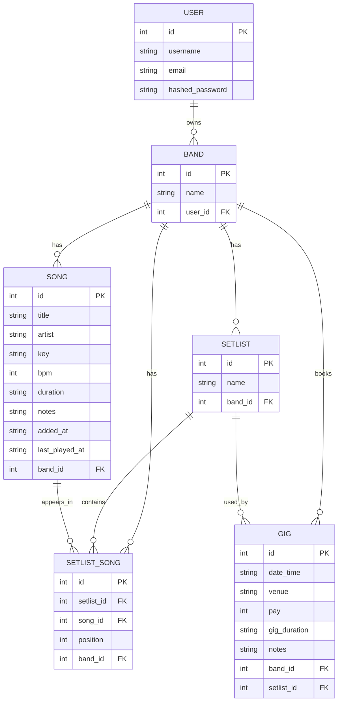

# Band Manager Web App

Band Manager makes it easy for smaller-scale bands to track necessary and important data, such as their finances, past/future gigs, setlists, and song rotation. 

## Demo Link
[Band Manager](https://band-management-pied.vercel.app)

## Features
- Add and delete songs from your band's rotation
- Create and reorder setlists from your song library
- Manage gig dates, venues, setlists, and finances

## Tech Stack
- Frontend: React + Shadcn & Tailwind CSS for styling
- Backend: FastAPI + SQLAlchemy
- Database: Supabase (Postgres)
- Deployment: Vercel (frontend), Render (backend)

## Architecture
The React-powered frontend authenticates its session by validating a stored JWT at the /users/me endpoint. Data endpoints currently identify the user/band by id. The backend is FastAPI + SQLAlchemy running CRUD operations against Supabase (running Postgres) via SQLAlchemy's ORM. The frontend's tables, dialog pop-ups, and date-pickers use Shadcn components, with Tailwind CSS styling the rest of the components.

## Data Model

- *One setlist can be reused across multiple gigs — gigs store a reference to their setlist, not the reverse.*

- *SetlistSongs reference Songs by FK, allowing multiple of the same song to be on a given setlist without issue. The Pydantic response schema then embeds the Song onto the SetlistSong as a property (ex. 'setlistSong.song.artist' becomes a valid path).*

## What I'd Do Next
- Improve auth to gate data endpoints by Bearer Token
- Allow multiple users to access the same band
- Implement an analytics page for finances and gigs (highest-paying venue, average hourly rate, etc.)
- Allow for imports/exports of setlist data from Spotify or other music platforms
